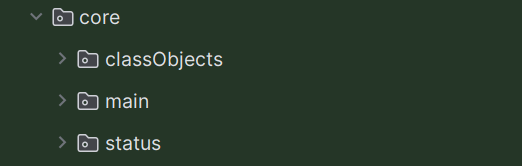

# Обзор библиотеки автоматизации тестирования для проекта Портал "Работа в России".  

---

### 1. Обзор структуры проекта 
Библиотека тестирования ДАПР содержит следующие каталоги:  

>* **base** - хранилище базового класса
>* **core** - хранилище основных методов взаимодействия с веб элементами станиц
>* **hashMaps** - хранилище хеш карт для тестов
>* **helpers** - хранилище вспомогательных классов 
>* **pages** - хранилище классов страниц 
>* **test**  - хранилище тестовых классов

### 1.1. Каталог "base"
Содержит в себе базовый класс **BrowserConfig** со стандартной конфигурацией браузера от которого наследуем все тесты

### 1.2. Каталог "core"
Содержит в себе каталоги:  

>* **classObjects** - хранилище класса для записи экземпляров классов
>* **main** - хранилище классов для взаимодействия с веб элементами ПРР
>* **status** - хранилище классов сбора динамической информации  

### 1.2.1. Каталог "classObjects"  
В класс "ClassObjects" записываем статические методы экземпляров классов

### 1.2.2. Каталог "main"  
Содержит в себе следующие классы:

  
>* Класс **Click** - методы кликов на различные веб элементы (_кнопки, митболы, переключатели, чекбоксы, 
радиобаттоны_)
>* Класс **DropDown** - методы заполнения выпадающих полей (_селектов_)
>* Класс **Input** - методы заполнения обычных стринговых полей
>* Класс **Open** - методы открытия URL адресов, ссылок внутри портала
>* Класс **SelectDoubleForms** - методы заполнения "парных" полей в конструкторах резюме/вакансии
>* Класс **SelectLanguages** - метод заполнения полей владения языками в конструкторах резюме/вакансии
>* Класс **SwitchWindow** - методы переключения между модальными окнами/стандартной областью контента, а так же  
методы создания и переключения между вкладками браузера

### 1.2.3. Каталог "status"
Содержит в себе следующие классы:  

>* Класс **InfoBlockHealth** - метод проверки наличия упавших инфоблоков на любой странице, на которой будет вызван метод 
из класса этого класса  
>* Класс **NotificationCheck** - метод поверки на появление всплывающих уведомлений (_нотификаций_)
>* Класс **Screenshot** - метод создания скриншота в произвольном месте теста

### 1.3. Каталог "hashMaps"
Содержит в себе каталоги:  

  
>* **actualHashMaps** - католог актуальных хеш карт (_хеш карты, которые заполняются во время прохождения теста_)
необходимых для проведения ассертов
>* **expectedHashMaps** - каталог эталонных хеш карт (_хеш карты, которые заполняются значениями из класса 
хранилища тестовых данных_) необходимых для проведения ассертов
>* **hashKeys** - каталог с хранилищем класса ключей для заполнения _актуальных_ и _эталонных_ хеш карт  

### 1.3.1. Каталог "actualHashMaps"
Содержит в себе следующие классы:  

>* Класс **ActualAuth** - хеш карта с актуальными значениями для тестов авторизации
>* Класс **ActualResume** - хеш карта с актуальными значениями для тестов создания резюме
>* Класс **ActualVacancy** - хеш карта с актуальными значениями для тестов создания вакансии

### 1.3.2. Каталог "expectedHashMaps"
Содержит в себе следующие классы:  

>* Класс **ActualAuth** - хеш карта с актуальными значениями для тестов авторизации
>* Класс **ActualResume** - хеш карта с актуальными значениями для тестов создания резюме
>* Класс **ActualVacancy** - хеш карта с актуальными значениями для тестов создания вакансии

### 1.4. Каталог "helpers"  
Содержит в себе каталоги:  

  
>* **collections** - хранилище классов для различных взаимодействий с коллекциями элементов
>* **owner** - хранилище классов библиотеки owner 

### 1.5. Каталог "pages"
Содержит в себе каталоги:

>* **admPages** - хранилище классов страниц легаси АДМ
>* **trudvsemPages** - хранилище классов страниц ПРР

### 1.5.1. Каталог "admPages"

>* Класс **MainAdmPage** класс основной страницы легаси АРМ с некоторыми уникальными методами для админки

### 1.5.2. Каталог "trudvsemPages"
Содержит в себе каталоги:  

>* **mainPrrPage** - каталог главной страницы неавторизованного, авторизованного(соискателя/работодателя) пользователя
>* **megaMenu** - каталог страниц из мега-меню
>* **resumePage** - каталог страниц связанных с резюме (мои резюме, конструктор резюме, карточка резюме)
>* **vacancyPage** - каталог страниц связанных с вакансиями (вакансии компании, конструктор вакансии, карточка вакансии)  

### 1.6. Каталог "test"  
Содержит в себе каталоги:  

  
>* **authTest** - каталог с тестами авторизации соискателем/работодателем
>* **develop** - каталог с пустым тестовым классом, для быстрого сбора небольших тестов (для деббага, проверки методов и т.д.)
>* **megaMenuTest** - каталог с тестами мега-меню
>* **resumeTests** - каталог с тестами резюме
>* **testValues** - каталог с классом, который содержит в себе тестовые данные для заполнения полей, конструткоров, фильтров и  
т.д.
>* **vacancyTests** - каталог с тестами вакансии